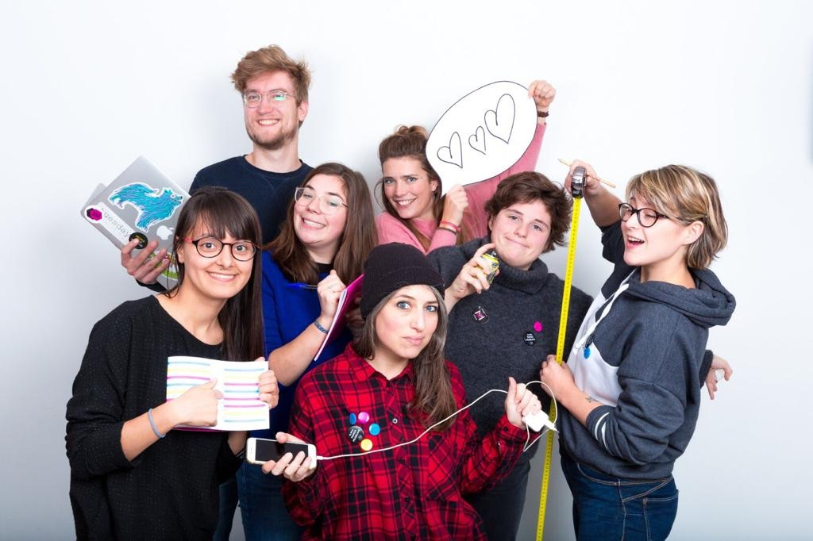

# ‘Peek-a-Mons’

Developed for the Museomix hackathon in Mons (Wallonia), this application renders a video screen challenge to invite museum visitors to visit other museum in the vincinity. 

## Concept

Our project challenge was to connect three museums of the Pôle Muséal Mons:

- Musée Doudou (folkloric museum of Mons)
- BAM (Mons museam of the fine arts)
- Artothèque (Museal depot with changing expositions)

Our concept was inspired by the video game ‘Portal’, as it opened up a silent gateway between the two museums where our project was installed.
The present web app was installed on a Raspberry Pi, connected to a widescreen monitor, that was hung as an artwork in the exposition at the BAM and at the Doudou. 
The screen at the Doudou showed the video stream from the BAM and vice versa. 
Surrounding the screen was a frame with cut-outs of exhibits from the other, connected museum.
The screen showed instructions for a game using the cut-outs: they could show the other participant which exhibits they saw around them, whilst also showing the player artpieces they were ‘missing out on’.

Our goals were to make a human connection between visitors that may not see eachother and to invite visitors to also go to other museums of Mons.

| Museum A | Museum B |
| :------ | :------ |
| At BAM | At Doudou |
| Frame has cut-outs of Doudou artworks | Frame has cut-outs of BAM artworks |
| Video shown of Doudou | Video stream of BAM |

The game existed of multiple phases like ‘looking for player’, ‘look for artworks’ and ‘just wave hi’. 
As there was no time to make presence sensors or algorithms, this was implemented as a simple repeating countdown per phase. 

> Photos from the presentation and the development can be found on [Instagram (@peekshowteam)](https://www.instagram.com/peekshowteam/). 

## Team

| Cristina PACA   | Redmer KRONEMEIJER | Margot COÏC | Elena BERTELLI | Hortense DE GHELLINCK | Clara MARTIN | Charlène CAMARELLA|
| :-------------: | :---------:        | :---------: | :------------: | :------:          | :----------: | :---------------: |
| Facilitator     | Developer          | Content    |  Communicator  | Mediator          | Designer     | Maker             |

## Limitations and implementation details

The concept was developed with the above team in three days during the 2018 Museomix in Mons (Wallonia). 
Developed in less than two days, with hotfixes during the presentation, it ran on a Raspberry Pi (2) with the Raspbian (Debian) OS and loaded in the Chromium web browser. 

The thermal limitations of the hardware meant that video stream manipulation was not possible: 
CSS mirroring or rotation caused device thermal throttling. 
Therefore the webcam was oriented in the same orientation as the screen (physically 90° right, 0° in CSS): 
then, the information texts were rendered flipped back (-90° in CSS).

It uses WebRTC as the communication protocol for establishing a video feed, using ScaleDrone as messaging relay. 
Change the ScaleDrone channel’s secret identifier in [script.js](script.js#l9) to make the app functional.

## Based on

The app was based on the “[Video chat App with WebRTC](https://github.com/herkyl/webrtc/)” by ‘[herkyl](https://github.com/herkyl/)’. 

## License

(c) The ‘Peek a Mons’ team, except for the base provided by [herkyl/webrtc](https://github.com/herkyl/webrtc/).  
Licensed as CC BY. 